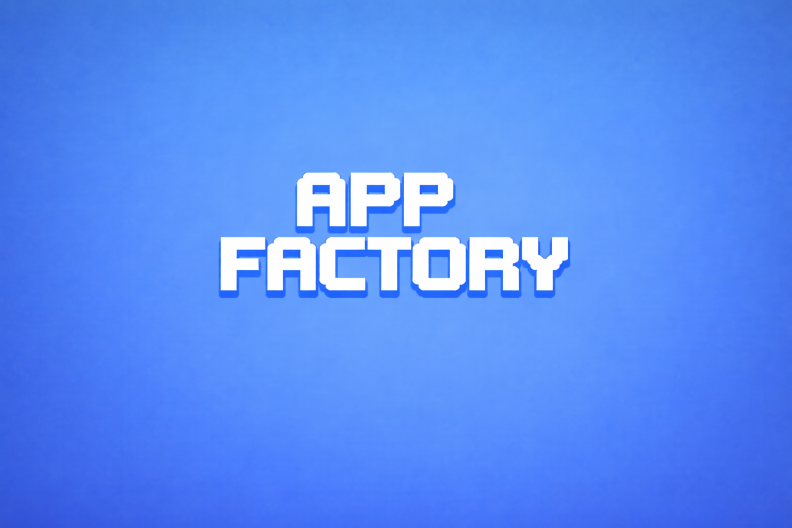

<p align="center">
  
</p>

<p align="center"><strong>App Factory</strong> — Turn signals into shipped apps.</p>

# App Factory

Transform market signals into production-ready mobile app specifications through systematic signal analysis and automated market research.

App Factory is a CLI-first pipeline that analyzes real user pain points across forums, reviews, and social platforms to generate comprehensive mobile app specifications with built-in monetization strategies.

## What App Factory Does

### ✅ Does
- **Signal Discovery**: Analyzes user frustrations across Reddit, social media, and reviews
- **Market Validation**: Identifies gaps between user needs and existing solutions  
- **Opportunity Ranking**: Generates and scores 10 app concepts with demand evidence
- **Complete Specifications**: Produces 11 detailed files ready for development
- **RevenueCat Integration**: Includes subscription setup and paywall strategies
- **Store Compliance**: Ensures App Store and Google Play guideline adherence

### ❌ Doesn't  
- Generate actual app code (produces specifications for developers)
- Store API keys or make live service calls (spec-level integration only)
- Handle complex enterprise requirements or regulatory compliance
- Replace market research expertise (augments with systematic signal analysis)

## Quick Start

**Prerequisites:**
- Python 3.8+
- [Claude CLI](https://docs.anthropic.com/claude/docs/claude-cli) from Anthropic

**Installation:**
```bash
git clone <your-repo-url>
cd app-factory
./scripts/install.sh
```

**Run Interactive Pipeline:**
```bash
./bin/appfactory
```

**Run Non-Interactive:**
```bash
./bin/appfactory run my-app-idea
```

## How It Works

App Factory executes a 9-stage pipeline that transforms signals into specifications:

1. **Market Research** - Signal analysis across forums, reviews, social media
2. **Idea Generation** - 10 ranked app concepts with evidence and scoring
3. **Product Specification** - Core features, success metrics, MVP scope
4. **UX Design** - User flows, accessibility requirements, design system
5. **Monetization Strategy** - RevenueCat integration, pricing, paywall design
6. **Technical Architecture** - Technology stack, security, performance requirements
7. **Quality Standards** - Testing strategy, performance benchmarks
8. **Brand Identity** - Visual guidelines, messaging, positioning
9. **Release Planning** - Store submission checklist, launch preparation

## What You Get

Every run generates a complete specification package:

```
runs/2026-01-06/my-app/spec/
├── 01_market_research.md      # Signal analysis & opportunities
├── 02_ideas.md               # 10 ranked app concepts  
├── 02_idea_selection.md      # Selected winner with rationale
├── 03_pricing.md             # Competitive pricing analysis
├── 04_product_spec.md        # Core features & success metrics
├── 05_ux.md                  # User experience design
├── 06_monetization.md        # RevenueCat integration plan
├── 07_architecture.md        # Technical implementation guide
├── 08_builder_handoff.md     # Development roadmap
├── 09_polish.md              # Quality & testing strategy
├── 10_brand.md               # Brand identity guidelines
└── 11_release_checklist.md   # Launch preparation
```

## CLI Commands

```bash
# Interactive mode (recommended)
./bin/appfactory

# Generate specifications  
./bin/appfactory run my-productivity-app

# Use stub mode for testing
./bin/appfactory run test-project --stub

# Check system health
./bin/appfactory doctor

# View all projects
./bin/appfactory list-runs
```

## Pipeline Flow

1. **Signal Discovery** → Real user pain points identified across platforms
2. **Idea Generation** → 10 concepts ranked by market opportunity and feasibility
3. **Auto-Selection** → Top-scoring idea selected with transparent criteria
4. **Specification Creation** → Complete development-ready documentation

## RevenueCat Integration (Spec-Level)

Every specification includes comprehensive subscription monetization:

- **Subscription Model Design** - Pricing tiers and feature gating strategy
- **RevenueCat Configuration** - Product setup, entitlements, SDK integration
- **Paywall Implementation** - UX flows and conversion optimization
- **Store Compliance** - App Store and Google Play subscription guidelines

*Note: Specifications include architecture and setup guidance. No live API calls are made during generation.*

## Who This Is For

**Perfect for:**
- Indie developers seeking validated app ideas
- Product teams exploring new opportunities  
- Developers who want comprehensive specs before coding
- Anyone tired of building apps nobody wants

**Not ideal for:**
- Complex enterprise software projects
- Apps requiring extensive custom research
- Projects with strict regulatory requirements

## Installation

**One-command install:**
```bash
./scripts/install.sh
```

**Manual setup:**
1. Install Claude CLI: [Installation Guide](https://docs.anthropic.com/claude/docs/claude-cli)
2. Install Python 3.8+ via your package manager
3. Clone this repository
4. Run `./bin/appfactory doctor` to verify setup

## Support This Project

App Factory is free and open source. If it helps you ship faster, consider supporting continued development:

**[💖 Sponsor on GitHub](https://github.com/sponsors/MeltedMindz)**

Your support enables:
- New signal sources and analysis methods
- Additional platform integrations  
- Enhanced specification templates
- Community feature requests

## Attribution

App Factory adds a small "Created with App Factory" footer to generated specification files only (never in final app code). Disable with:

```bash
./bin/appfactory run my-app --no-attribution
# or
export APPFACTORY_NO_ATTRIBUTION=true
```

No tracking or telemetry is included.

## CLI Reference

### Global Options
- `--no-attribution` - Disable attribution footer in spec files
- `--verbose` - Enable detailed logging and progress output
- `--stub` - Use offline mode (synthetic content for testing)
- `--timeout SECONDS` - Set Claude operation timeout (default: 120)

### Commands
- `run [project-name]` - Execute complete pipeline
- `status` - Show current run progress  
- `list-runs` - Browse all generated projects
- `doctor` - Verify system dependencies
- `clean` - Remove old artifacts

## Troubleshooting

**Most common issues:**

1. **Claude CLI not found**: Install from [Anthropic's guide](https://docs.anthropic.com/claude/docs/claude-cli)
2. **Authentication failed**: Run `claude auth login`
3. **Timeout errors**: Increase with `--timeout=300` or check network connectivity
4. **Permission denied**: Ensure write permissions in project directory

**For detailed troubleshooting**: See `BUILDERS/TROUBLESHOOTING.md`

**System check**: `./bin/appfactory doctor`

## Contributing

App Factory is open source and welcomes contributions. See `BUILDERS/CONTRIBUTING.md` for development guidelines.

**Technical documentation**: `BUILDERS/` folder contains:
- Pipeline architecture details
- Stage execution contracts  
- Testing and development setup
- Adding new signal sources

## License

Open source under MIT License - see LICENSE file for details.

---

*App Factory helps you build apps people actually want by starting with real market signals instead of assumptions.*