<p align="center">
  
</p>

# App Factory

**From market research to production-ready mobile apps in two commands.**

App Factory is an intelligent pipeline that researches real market opportunities, generates validated app ideas, and builds complete mobile applications. It combines market research, product specification, UX design, technical architecture, and React Native development into a single automated workflow.

**What makes it different**: Every generated app traces back to real market evidence. No generic templates, no disconnected specs—just apps built to solve actual user problems with validated business models.

## How It Works

App Factory runs in stages, with each stage building on previous outputs to create a complete, connected specification:

```mermaid
graph TD
    A[📝 Stage 00: Intake] --> B[🔍 Stage 01: Market Research]
    B --> C[📊 10 Ranked Ideas]
    C --> D{Choose One Idea}
    D --> E[📋 Stage 02: Product Spec]
    E --> F[🎨 Stage 03: UX Design]
    F --> G[💰 Stage 04: Monetization]
    G --> H[🏗️ Stage 05: Architecture]
    H --> I[🔧 Stage 06-09: Polish & Brand]
    I --> J[📱 Stage 10: React Native App]
    
    B --> K[📈 Global Leaderboard]
    J --> L[🚀 Production-Ready App]
```



**Stage-by-Stage Output:**
| Stage | Purpose | Key Output | Why It Matters |
|-------|---------|------------|----------------|
| 01 | Market Research | `stage01.json` (10 ranked ideas) | Evidence-backed opportunities |
| 02 | Product Spec | `stage02.json` (features, users, metrics) | What to build and why |
| 03 | UX Design | `stage03.json` (wireframes, flows, accessibility) | How users interact |
| 04 | Monetization | `stage04.json` (pricing, subscriptions, RevenueCat) | How it makes money |
| 05-09 | Architecture & Brand | `stage05-09.json` (tech stack, polish, ASO) | How it's built and positioned |
| 10 | App Generation | `builds/<idea>/app/` (complete Expo app) | What you ship |

## The Two Core Commands

**Open Claude in this repository and type:**

### Generate 10 Ranked App Ideas
```
run app factory
```
*Researches markets and generates 10 ranked app ideas for selective building*

- **Input**: Market signals and user constraints  
- **Output**: 10 ranked app ideas in idea bin
- **Duration**: Automated idea generation
- **Result**: Validated ideas ready for selective building

### Build Selected App  
```
build <IDEA_NAME>
```  
*Builds ONE chosen idea into a complete production-ready app*

- **Input**: One idea from your idea bin
- **Output**: Complete React Native app in `builds/` directory  
- **Duration**: Automated app building
- **Result**: Store-ready mobile application with complete specs

### Example Workflow
```bash
# Step 1: Generate 10 ranked app ideas
run app factory

# Step 2: Pick your favorite idea and build it completely
build "FocusFlow AI"

# Result: One complete mobile app ready for App Store submission
```

## Why This Is Different

**Connected Decisions, Not Isolated Templates**

Most AI tools generate disconnected outputs. App Factory ensures every specification connects:

- Market research **directly informs** product features
- Product features **directly inform** UX wireframes  
- UX wireframes **directly inform** technical architecture
- Technical architecture **directly informs** the actual React Native code
- Monetization strategy **directly informs** RevenueCat integration
- Brand identity **directly informs** UI theme and styling

**Result**: Every line of generated code traces back to market evidence.

**Selective Execution, Not Batch Waste**

App Factory gives you choice and control:

- Generate 10 ideas quickly, then choose your winner  
- Build only the idea you want
- No wasted tokens on apps you'll never use
- No commitment until you explicitly choose to build

## Truth Enforcement

**Success is files-on-disk.** No stubs, no placeholders, no false success claims.

✅ All 100+ JSON outputs validate against schemas  
✅ All execution steps documented in logs  
✅ All specifications rendered to markdown  
✅ Built apps are complete and runnable for the selected idea  
✅ Every constraint maps to actual implementation  

**If it's not written to disk with binding proof, it didn't happen.**

## Tech Stack

**Modern, Proven, Store-Ready**

- **Framework**: React Native + Expo (latest stable)
- **Navigation**: Expo Router (file-based)
- **Monetization**: RevenueCat (subscription-first)
- **Storage**: AsyncStorage + SQLite
- **Auth**: Guest-first, optional accounts
- **Platforms**: iOS + Android simultaneously

**Why These Choices**: Each technology decision traces back to market research and monetization strategy from your specifications.

## Getting Started

**Prerequisites**: Claude subscription + this repository

```bash
# 1. Clone the repository
git clone <this-repo>
cd app-factory

# 2. Open Claude and point it to this directory  
# (Claude will automatically read CLAUDE.md constitution)

# 3. Generate complete specifications for 10 app ideas
run app factory

# 4. Build your favorite idea into a complete app
build "Your Chosen Idea Name"

# 5. Your app is ready in builds/ directory
cd builds/01_your_idea__idea_id_001/<build_id>/app
npm install
npm start
```

**That's it.** No configuration, no prompts, no hand-holding.

## Who This Is For

**Builders who want outcomes, not processes:**

✅ **Indie developers** - Generate validated app ideas + complete implementations  
✅ **Agencies** - Deliver complete mobile apps with full documentation  
✅ **Product managers** - Get market-backed specifications for any app concept  
✅ **Entrepreneurs** - Turn market research into store-ready applications  
✅ **Technical founders** - Skip months of specification work  

**Not for**: Teams that enjoy writing specifications manually, or developers who prefer building everything from scratch.

**Perfect for**: Anyone who wants to ship mobile apps faster with market validation baked in.

## Output Structure

**After `run app factory` (idea generation):**

```
runs/YYYY-MM-DD/your-run-name/
├── stage01/
│   ├── stages/stage01.json               # 10 ranked app ideas
│   └── spec/01_market_research.md
├── ideas/                                # Idea bin (metadata only)
│   ├── 01_focusflow_ai__focus_ai_001/
│   │   └── meta/                         # Metadata only
│   ├── 02_mindful_habits__habits_002/
│   │   └── meta/                         # Metadata only
│   └── ...                               # 8 more idea directories
└── meta/
    └── idea_index.json                   # Master index for building
```

**After `build "FocusFlow AI"` (selective building):**

```
builds/01_focusflow_ai__focus_ai_001/     # Built app only
└── <build_id>/                          # Immutable build output
    ├── app/                             # Complete Expo app
    │   ├── package.json                 # Complete Expo config
    │   ├── src/screens/                 # All app screens
    │   ├── src/services/purchases.js    # RevenueCat integration
    │   └── README.md                    # Setup instructions
    ├── build_log.md                     # Build execution log
    └── sources.md                       # Research citations

runs/YYYY-MM-DD/your-run-name/ideas/01_focusflow_ai__focus_ai_001/
├── stages/                              # Now contains stages 02-10
├── outputs/                             # All execution logs
└── spec/                                # Complete specifications
```

## Repository Hygiene

**Generated outputs** (`runs/` and `builds/`) are ignored by git and never committed:

- **`runs/`** - All pipeline execution outputs and specifications
- **`builds/`** - Complete React Native apps built from selected ideas

**Clean repository**: `scripts/clean_repo.sh`  
**Check ship-readiness**: `scripts/ship_check.sh`

All builds go to `builds/<idea_dir>/` - never a fixed location.

## What You Get

**After `run app factory`**:
- 10 ranked, validated app ideas with market evidence
- Complete market research specifications in markdown
- Global leaderboard tracking all ideas across runs
- Ready-to-build idea bin for selective development

**After `build <IDEA_NAME>`**:
- Complete React Native app with full source code
- Production-ready Expo configuration
- Integrated RevenueCat subscription system
- Store-submission-ready mobile application
- Complete technical specifications and documentation

## Quickstart

1. **Open Claude** in this repository
2. **Type**: `run app factory`  
3. **Choose** your favorite from 10 ranked ideas
4. **Type**: `build "Your Chosen Idea"`
5. **Launch**: Your app is in `builds/` directory

No configuration, no prompts, no hand-holding.

## Leaderboard Explained

App Factory tracks every idea generated across all runs:

**Raw Leaderboard**: Permanent record of all ideas with original rankings  
**Global Leaderboard**: Best ideas across all runs, automatically updated  

Top ideas remain discoverable regardless of when they were generated.

---

## Contributing

**Welcome Contributors!**

App Factory thrives on community input. Whether you're improving the pipeline, fixing bugs, or adding features, your contributions help everyone build better apps faster.

**Easy Ways to Start:**
- 🐛 **Report issues** - Found a bug? Let us know
- 💡 **Suggest improvements** - Ideas for better pipeline stages or features
- 📝 **Improve docs** - Make templates and guides clearer
- 🧪 **Add quality checks** - Help improve validation and reliability
- 🔧 **Submit PRs** - Code contributions always welcome

**Key Development Principles:**
- **Agent-native execution**: Claude is the primary runner
- **Filesystem truth**: No false success claims - if it's not on disk, it didn't happen
- **Schema validation**: Everything must validate against defined schemas
- **Connected specs**: Every decision traces back to market research evidence

**Getting Involved**: Check out issues, suggest improvements, or dive into the codebase. All skill levels welcome!

## License

**MIT License** - This project is open source and free to use. See LICENSE file for details.

## Support Open Source Development

App Factory is developed and maintained as an **open source project**. If this tool helps you build better mobile applications faster, please consider supporting its continued development.

### ⭐ Ways to Support

- **Star this repository** - Help others discover App Factory
- **Share the project** - Tell other developers about agent-native app generation
- **Contribute code** - Submit improvements and new features
- **Report issues** - Help us improve reliability and usability
- **Sponsor development** - Support ongoing maintenance and new features

### 💖 Become a Sponsor

Your sponsorship helps:
- 🚀 **Add new pipeline stages** for advanced app features
- 🔧 **Improve validation** and error handling
- 📱 **Support new frameworks** beyond React Native
- 🌐 **Enhance signal sources** for better market research
- 📚 **Create tutorials** and documentation
- 🐛 **Fix bugs** and performance issues

[**Sponsor App Factory on GitHub →**](https://github.com/sponsors/MeltedMindz)

Every contribution, whether code or financial, helps make App Factory better for the entire developer community. Thank you for supporting open source! 🙏

---

**App Factory: From market research to React Native code — in two commands.**