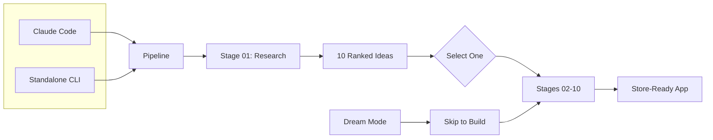

<p align="center">
  
</p>

# App Factory & Web3 Factory

**Dual AI-Native Development Systems**

This repository contains two isolated factory systems:
- **App Factory** (`/the_factory/`) - Consumer mobile apps with subscription monetization
- **Web3 Factory** (`/web3-factory/`) - Tokenized web apps with Solana integration (in development)

---

## App Factory

**From idea to store-ready mobile app in one command.**

App Factory researches markets, validates ideas, and builds complete React Native mobile applications. Every generated app traces back to real market evidence.

### Quick Start

**Using Claude Code:**
```bash
cd the_factory

run app factory          # Generate 10 ranked app ideas
build <IDEA_NAME>        # Build selected idea into complete app
dream <your idea>        # Skip research, build any idea directly
```

**Using the Standalone CLI:**
```bash
cd CLI
npm install && cp .env.example .env
# Add ANTHROPIC_API_KEY=sk-ant-your-key to .env
npm start                # Interactive menu with arrow keys
```

The CLI runs the same pipeline using your Anthropic API key. No Claude Code subscription required.

---

## Web3 Factory

**Transform ideas into tokenized web apps with Solana integration.**

Web3 Factory validates Web3 concepts, defines token economics, and builds complete tokenized web applications with Bags SDK integration.

### Quick Start

```bash
cd web3-factory

web3 idea <your concept>  # Transform idea into tokenized web app
```

---

## How It Works



| Stage | What Happens |
|-------|--------------|
| 01 | Market research generates 10 ranked app ideas |
| 02-09 | Product spec, UX design, monetization, architecture, brand |
| 10 | Professional enforcement layer builds zero-defect Expo app |

## What You Get

**After building:**
- Complete Expo React Native app with TypeScript
- RevenueCat subscription integration
- Store-ready assets, privacy policy, launch plan
- Passes 14 quality gates before completion

## Repository Structure

```
/the_factory/     # App Factory - mobile apps with subscriptions
/CLI/             # Standalone CLI - same pipeline, your API key
/web3-factory/    # Web3 Factory - tokenized web apps (in development)
```

## Tech Stack

| | App Factory | Web3 Factory |
|--|-------------|--------------|
| **Platform** | iOS/Android Mobile | Web Browsers |
| **Framework** | React Native + Expo | Next.js/Vite + React |
| **Monetization** | RevenueCat subscriptions | Solana tokens (Bags SDK) |
| **Pipeline** | Stages 01-10 | Stages W1-W5 |

## Documentation

- [App Factory Details](the_factory/README.md) - Full pipeline documentation
- [CLI Documentation](CLI/README.md) - Standalone CLI setup and usage
- [Web3 Factory](web3-factory/README.md) - Tokenized web apps (in development)

## Contributing

Contributions welcome. See issues for ways to help.

## License

MIT License - See LICENSE file.

---

**$FACTORY** - [bags.fm/BkSbFrDMkfkoG4NDUwadEGeQgVwoXkR3F3P1MPUnBAGS](https://bags.fm/BkSbFrDMkfkoG4NDUwadEGeQgVwoXkR3F3P1MPUnBAGS)
