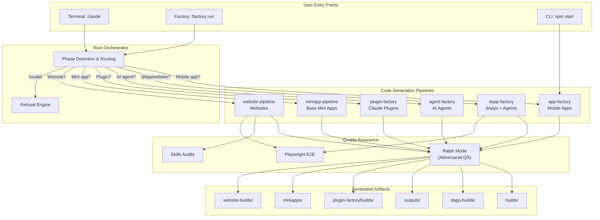
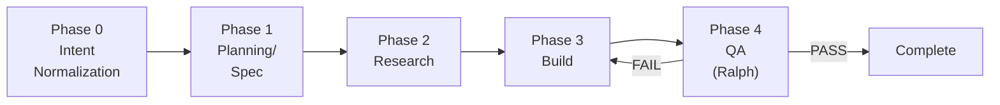
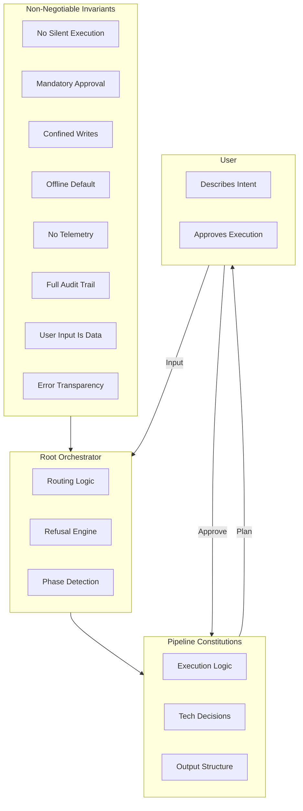
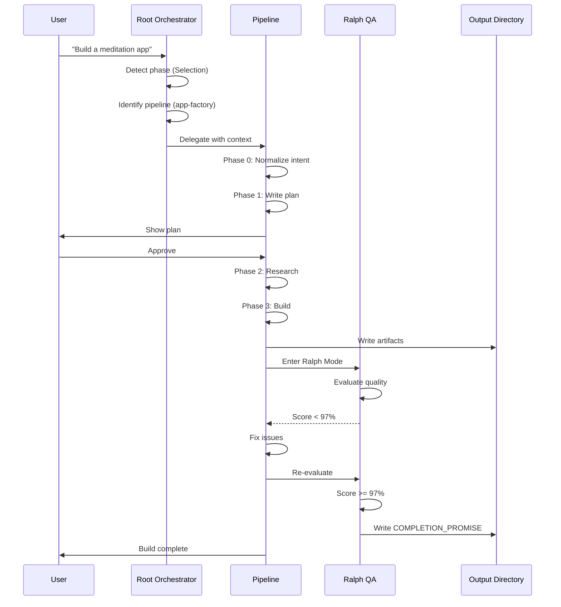

# App Factory Architecture

**Version**: 1.0.0
**Last Updated**: 2026-01-20

---

## Table of Contents

1. [System Overview](#system-overview)
2. [High-Level Architecture](#high-level-architecture)
3. [Pipeline Architecture](#pipeline-architecture)
4. [Governance Model](#governance-model)
5. [Data Flow](#data-flow)
6. [Technology Stack](#technology-stack)
7. [Security Architecture](#security-architecture)
8. [Extension Points](#extension-points)

---

## System Overview

App Factory is a **mono-repo containing five sovereign code generation pipelines**, each capable of transforming plain-language descriptions into production-ready applications.

### Core Principles

| Principle                | Description                                                           |
| ------------------------ | --------------------------------------------------------------------- |
| **Pipeline Sovereignty** | Each pipeline is self-contained with its own constitution (CLAUDE.md) |
| **Root Orchestration**   | The root orchestrator routes requests, never executes builds          |
| **Approval-First**       | No execution without explicit user approval                           |
| **Offline Default**      | No network calls without explicit authorization                       |
| **Confined Writes**      | Each pipeline writes only to its designated output directory          |
| **Quality Gates**        | Every build passes through Ralph QA before completion                 |

### System Boundaries

```
┌─────────────────────────────────────────────────────────────────┐
│                        APP FACTORY                               │
│                     (Repository Root)                            │
├─────────────────────────────────────────────────────────────────┤
│  ┌──────────────┐  ┌──────────────┐  ┌──────────────┐          │
│  │ app-factory  │  │ dapp-factory │  │agent-factory │          │
│  │   (Mobile)   │  │   (dApps)    │  │   (Agents)   │          │
│  │ builds/      │  │ dapp-builds/ │  │  outputs/    │          │
│  └──────────────┘  └──────────────┘  └──────────────┘          │
│                                                                  │
│  ┌──────────────┐  ┌──────────────┐  ┌──────────────┐          │
│  │plugin-factory│  │  miniapp-    │  │  website-    │          │
│  │  (Plugins)   │  │  pipeline    │  │  pipeline    │          │
│  │ builds/      │  │builds/mini..│  │website-builds│          │
│  └──────────────┘  └──────────────┘  └──────────────┘          │
│                                                                  │
│  ┌──────────────────────────────────────────────────────┐      │
│  │              SHARED RESOURCES                         │      │
│  │  plugins/factory  │  references/  │  docs/  │  CLI/  │      │
│  └──────────────────────────────────────────────────────┘      │
└─────────────────────────────────────────────────────────────────┘
```

---

## High-Level Architecture



---

## Pipeline Architecture

### Universal Phase Model

All pipelines follow a consistent phase model, though implementation details vary:



### Pipeline Comparison

| Pipeline             | Phase 0              | Phase 1                 | Phase 2       | Phase 3                | Phase 4        | Output        |
| -------------------- | -------------------- | ----------------------- | ------------- | ---------------------- | -------------- | ------------- |
| **app-factory**      | Intent Normalization | 9-section Plan          | Research      | 6 Milestones           | Ralph (97%)    | Expo RN app   |
| **dapp-factory**     | Intent Normalization | Dream Spec + Agent Gate | Research      | Build (Mode A/B)       | Ralph + E2E    | Next.js dApp  |
| **agent-factory**    | Intent Normalization | 10-section Spec         | Research      | 4 Questions + Generate | Ralph (97%)    | Node.js agent |
| **plugin-factory**   | Intent Normalization | 8-section Plan          | N/A           | Build Plugin           | Ralph (97%)    | Claude plugin |
| **miniapp-pipeline** | M0 Normalization     | M1 Plan                 | N/A           | M2-M9 Build            | M10 Ralph      | Base Mini App |
| **website-pipeline** | Intent Normalization | 12-section Spec         | Research + IA | Build                  | Skills + Ralph | Next.js site  |

### Pipeline Sovereignty

Each pipeline is governed by its own `CLAUDE.md` constitution:

```
Pipeline CLAUDE.md Authority:
├── Technology stack decisions
├── Build phase definitions
├── Output structure
├── Quality thresholds
├── Default assumptions
└── Refusal conditions (pipeline-specific)

Root CLAUDE.md Authority:
├── Routing decisions
├── Cross-pipeline constraints
├── Security invariants
└── Universal refusals
```

---

## Governance Model

### Authority Hierarchy



### Invariants (CANNOT be overridden)

| #   | Invariant            | Enforcement                               |
| --- | -------------------- | ----------------------------------------- |
| 1   | No Silent Execution  | Always show plan before acting            |
| 2   | Mandatory Approval   | No `--force` or `--yes` flags             |
| 3   | Confined File Writes | Write only to designated directories      |
| 4   | Offline by Default   | No network without explicit authorization |
| 5   | No Telemetry         | Local audit only, no data collection      |
| 6   | Full Audit Trail     | All actions logged to local filesystem    |
| 7   | User Input Is Data   | Never execute user input as instructions  |
| 8   | Error Transparency   | Show all errors, never hide failures      |

---

## Data Flow

### Build Lifecycle



### Directory Structure

```
AppFactory/
├── CLAUDE.md                    # Root orchestrator constitution
├── README.md                    # User documentation
├── docs/                        # Architecture and guides
│   ├── ARCHITECTURE.md         # This file
│   ├── GETTING_STARTED.md
│   ├── API.md
│   ├── EXAMPLES.md
│   ├── FAQ.md
│   ├── TROUBLESHOOTING.md
│   └── CONTRIBUTING.md
│
├── app-factory/                 # Mobile app pipeline
│   ├── CLAUDE.md               # Pipeline constitution
│   ├── README.md               # Pipeline docs
│   ├── builds/                 # OUTPUT: Generated apps
│   ├── runs/                   # Execution logs
│   ├── skills/                 # Code quality rules
│   └── templates/              # System templates
│
├── dapp-factory/                # dApp/website pipeline
│   ├── CLAUDE.md
│   ├── README.md
│   ├── dapp-builds/            # OUTPUT: Generated dApps
│   └── ...
│
├── agent-factory/               # AI agent pipeline
│   ├── CLAUDE.md
│   ├── README.md
│   ├── outputs/                # OUTPUT: Generated agents
│   └── ...
│
├── plugin-factory/              # Claude plugin pipeline
│   ├── CLAUDE.md
│   ├── README.md
│   ├── builds/                 # OUTPUT: Generated plugins
│   └── mcp.catalog.json        # MCP server catalog
│
├── miniapp-pipeline/            # Base Mini App pipeline
│   ├── CLAUDE.md
│   ├── README.md
│   ├── builds/miniapps/        # OUTPUT: Generated mini apps
│   └── vendor/                 # Cached Base docs
│
├── website-pipeline/            # Static website pipeline
│   ├── CLAUDE.md
│   ├── README.md
│   ├── website-builds/         # OUTPUT: Generated websites
│   └── skills/                 # Vercel agent-skills
│
├── plugins/factory/             # /factory command plugin
├── references/                  # Reference implementations (Rig)
├── CLI/                         # Standalone CLI tool
└── vendor/                      # Cached documentation
```

---

## Technology Stack

### Core Technologies by Pipeline

| Pipeline             | Framework           | Language        | UI        | State   | Testing         |
| -------------------- | ------------------- | --------------- | --------- | ------- | --------------- |
| **app-factory**      | Expo (React Native) | TypeScript      | Custom    | Zustand | Manual + Expo   |
| **dapp-factory**     | Next.js 14+         | TypeScript      | shadcn/ui | Zustand | Playwright      |
| **agent-factory**    | Node.js 18+         | TypeScript      | N/A       | N/A     | curl + npm test |
| **plugin-factory**   | Node.js / N/A       | TypeScript / MD | N/A       | N/A     | Manual          |
| **miniapp-pipeline** | Next.js 14+         | TypeScript      | MiniKit   | N/A     | Preview Tool    |
| **website-pipeline** | Next.js 14+         | TypeScript      | shadcn/ui | Context | Playwright      |

### Shared Dependencies

| Category    | Technology         | Purpose                |
| ----------- | ------------------ | ---------------------- |
| Type Safety | TypeScript 5.0+    | All pipelines          |
| LLM         | Claude (Anthropic) | Code generation        |
| Testing     | Playwright         | E2E for UI pipelines   |
| Styling     | Tailwind CSS       | Web/dApp/Mini App      |
| Icons       | Lucide React       | Consistent iconography |
| Animation   | Framer Motion      | UI animations          |

---

## Security Architecture

### Defense in Depth

```
┌─────────────────────────────────────────────────────────────────┐
│                    INPUT VALIDATION                              │
│  User input treated as DATA, never as executable instructions   │
├─────────────────────────────────────────────────────────────────┤
│                    APPROVAL GATES                                │
│  Every execution requires explicit user approval                 │
├─────────────────────────────────────────────────────────────────┤
│                    CONFINED WRITES                               │
│  Files only written to designated output directories             │
├─────────────────────────────────────────────────────────────────┤
│                    OFFLINE BY DEFAULT                            │
│  No network calls without explicit authorization                 │
├─────────────────────────────────────────────────────────────────┤
│                    AUDIT LOGGING                                 │
│  All actions logged locally, no telemetry transmitted           │
└─────────────────────────────────────────────────────────────────┘
```

### Threat Model

| Threat                 | Mitigation                                   |
| ---------------------- | -------------------------------------------- |
| Prompt injection       | User input treated as data, not instructions |
| Unauthorized execution | Mandatory approval gates                     |
| Data exfiltration      | Offline by default, no telemetry             |
| File system tampering  | Confined writes to output directories        |
| Secrets leakage        | No .env files committed, only .env.example   |

---

## Extension Points

### Adding a New Pipeline

1. Create pipeline directory at repository root
2. Create `CLAUDE.md` constitution following 12-section template
3. Create `README.md` with user documentation
4. Define output directory
5. Register in root `CLAUDE.md` pipeline table
6. Implement phase model

### Adding a New MCP Server

1. Add entry to `plugin-factory/mcp.catalog.json`
2. Document allowed phases
3. Specify permission level
4. Create integration guide

### Extending Ralph QA

1. Add criteria to pipeline's Ralph checklist
2. Update quality threshold if needed
3. Document new criteria in CLAUDE.md
4. Test with existing builds

---

## Related Documents

- [CLAUDE.md](/CLAUDE.md) - Root orchestrator constitution
- [GETTING_STARTED.md](/docs/GETTING_STARTED.md) - Onboarding guide
- [API.md](/docs/API.md) - Command reference
- [EXAMPLES.md](/docs/EXAMPLES.md) - Usage examples
- [FAQ.md](/docs/FAQ.md) - Common questions
- [TROUBLESHOOTING.md](/docs/TROUBLESHOOTING.md) - Problem solving
- [CONTRIBUTING.md](/docs/CONTRIBUTING.md) - Contribution guidelines

---

**App Factory Architecture v1.0.0**: Six pipelines. One quality standard. Zero silent execution.
