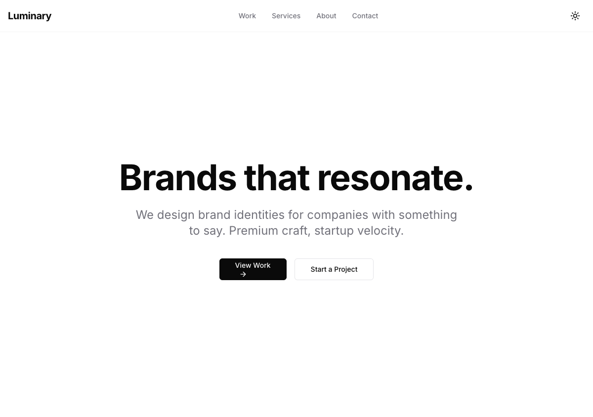
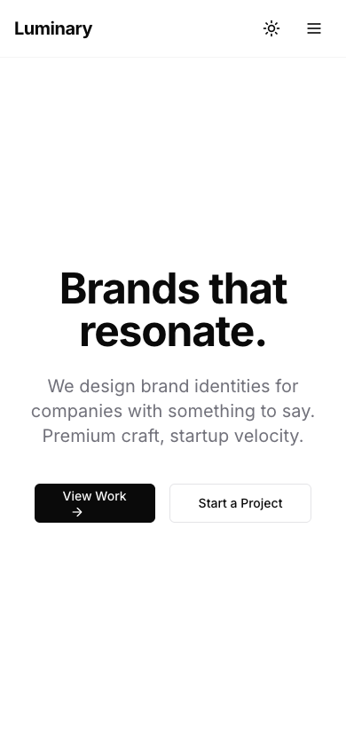

# Website Pipeline Demo: Luminary Studio

This directory contains a complete example of a website built using the **website-pipeline**. The site is a portfolio for a fictional brand identity studio called "Luminary Studio."

---

## What Was Built

**Luminary Studio** is a portfolio website for a creative agency specializing in brand identity design. It showcases:

- Hero section with bold typography and CTAs
- Featured work portfolio with 4 case studies
- Services overview
- Client testimonial
- Contact CTA section
- Full footer with navigation and social links

---

## Screenshots

### Home Page - Hero Section (Dark Mode)

The hero features a bold headline "Brands that resonate." with the studio's value proposition and two call-to-action buttons.



### Full Home Page

The complete home page showing all sections: hero, featured work, services, testimonial, and CTA.


### Light Mode

The website supports dark/light mode toggle. Here's the light mode view with the accent-colored theme toggle.


### Custom 404 Page

A branded 404 page with helpful messaging and a back-to-home button.


### Mobile Responsive View

The site is fully responsive. On mobile, the navigation collapses to a hamburger menu.



### Mobile Navigation Menu

The expanded mobile menu with smooth animations.


---

## How It Was Created

### The Pipeline Process

This website was generated through the **website-pipeline**, an 8-phase automated process:

```
Phase 0: Intent Normalization
         "Build a portfolio website for a design studio called Luminary"
         ↓ Expanded to full website specification

Phase 1: Dream Spec Author
         ↓ 12-section comprehensive spec (dream_spec.md)

Phase 2: Research & Positioning
         ↓ Market research, competitor analysis, positioning strategy

Phase 3: Information Architecture
         ↓ Sitemap, content model, navigation structure

Phase 4: Design System
         ↓ Colors, typography, spacing, components

Phase 5: Build
         ↓ Complete Next.js 14 website

Phase 6: Skills Audit ◆ GATE 1
         ↓ react-best-practices (96%), web-design-guidelines (94%)

Phase 7: SEO Review ◆ GATE 2
         ↓ Technical, on-page, performance, social SEO (100%)

Phase 8: Ralph Polish Loop ◆ GATE 3
         ↓ Final QA verification (100% pass)
```

### Technology Stack

| Component | Technology |
|-----------|------------|
| Framework | Next.js 14 (App Router) |
| Language | TypeScript |
| Styling | Tailwind CSS |
| Components | Custom + shadcn/ui patterns |
| Animation | Framer Motion |
| Icons | Lucide React |
| Themes | next-themes |

### Quality Gates Passed

| Gate | Score | Status |
|------|-------|--------|
| react-best-practices | 96% | PASS |
| web-design-guidelines | 94% | PASS |
| seo-guidelines | 100% | PASS |
| Ralph Final | 100% | PASS |

---

## Directory Structure

```
example/
├── README.md                 # This file
├── screenshots/              # Website screenshots
│   ├── 01-home-hero.png
│   ├── 02-home-full.png
│   ├── 03-home-light-mode.png
│   ├── 04-404-page.png
│   ├── 05-mobile-view.png
│   └── 06-mobile-menu.png
├── runs/                     # Pipeline execution artifacts
│   └── 2026-01-18/
│       └── luminary-001/
│           ├── inputs/       # Spec documents
│           │   ├── raw_input.md
│           │   ├── normalized_prompt.md
│           │   └── dream_spec.md
│           └── polish/       # Ralph QA reports
│               ├── ralph_report_1.md
│               └── ralph_final_verdict.md
└── website-builds/           # Generated website
    └── luminary-studio/
        ├── package.json
        ├── src/
        │   ├── app/          # Next.js pages
        │   ├── components/   # UI components
        │   └── lib/          # Utilities & data
        ├── research/         # Market research docs
        ├── planning/         # IA & design system
        └── audits/           # Skills audit reports
```

---

## Running the Demo

```bash
# Navigate to the website
cd website-builds/luminary-studio

# Install dependencies
npm install

# Start development server
npm run dev

# Open http://localhost:3000 (or next available port)
```

---

## Key Features Demonstrated

### 1. Framer Motion Animations
- Page entrance animations (fade up)
- Staggered list animations for project cards
- Hover/tap feedback on buttons
- Mobile menu slide animation

### 2. Accessibility (WCAG 2.1 AA)
- Skip to main content link
- ARIA labels on all icon buttons
- Semantic HTML structure
- Keyboard navigation support
- Focus indicators on all interactive elements

### 3. Dark Mode Support
- System preference detection
- Manual toggle with theme persistence
- Proper color contrast in both modes

### 4. Responsive Design
- Mobile-first approach
- Hamburger menu on mobile
- Fluid typography and spacing
- Optimized images with next/image

### 5. SEO Optimization
- Metadata configuration
- Open Graph tags
- Sitemap generation
- robots.txt configuration

---

## What the Skills Audits Checked

### react-best-practices (96%)
- No barrel imports (direct component imports)
- Server Components by default
- Client directive only where needed
- next/image for all images
- next/font for typography

### web-design-guidelines (94%)
- Semantic HTML throughout
- ARIA labels on icon buttons
- Color contrast meets WCAG AA
- Page entrance animations
- Hover/tap feedback
- Reduced motion support

### seo-guidelines (100%)
- robots.txt present
- Sitemap generated
- Proper title/description metadata
- Open Graph configuration
- Core Web Vitals optimized

---

## Generated: 2026-01-18

Built with the **website-pipeline** from [AppFactory](https://github.com/MeltedMindz/appfactory).
